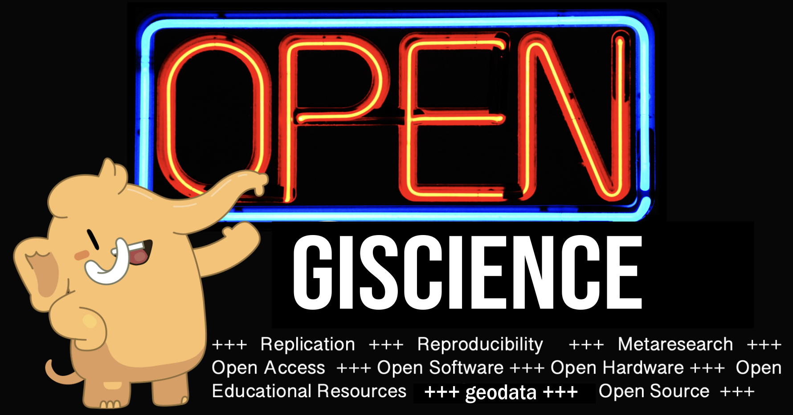

<h4 align="center">This repository contains Mastodon  accounts of rspatial  developers and contributors 👩‍💻 👨‍💻, as well as some of their communities 📣 .</h4>

# 🔵 People

- Adrián Calleros - https://fosstodon.org/@calleros
- Alex Quevedo - https://fosstodon.org/@alequech
- Antony Barja - https://fosstodon.org/@ambarja
- Dewey Dunnington - https://fosstodon.org/@paleolimbot
- Edzer Pebesma - https://fosstodon.org/@edzer@mastodon.social
- Elio Campitelli - https://fosstodon.org/@eliocamp@mastodon.social
- Gabo Gaona - https://fosstodon.org/@gavg712
- Hanna Meyer - https://fosstodon.org/@HannaMeyer@fediscience.org
- Lorena Abad - https://fosstodon.org/@loreabad6
- Michael Dorman - https://fosstodon.org/@michaeldorman84
- Michael Sumner - https://fosstodon.org/@mdsumner
- Mike Mahoney - https://fosstodon.org/@MikeMahoney218
- Jakub Nowosad - https://fosstodon.org/@nowosad
- Rafael H M Pereira - https://fosstodon.org/@UrbanDemog@toot.community
- Raúl Nanclares - https://fosstodon.org/@rnanclares
- Robin Lovelace - https://fosstodon.org/@robinlovelace
- Roger Bivand - https://fosstodon.org/@rsbivand
- Spencer Schien - https://fosstodon.org/@MrPecners
- Tim Appelhans - https://fosstodon.org/@tim_salabim
- Timothée Giraud - https://fosstodon.org/@rcarto
- Tyler Morgan - https://fosstodon.org/@tylermorganwall
- Veronica Andreo - https://fosstodon.org/@VeronicaAndreo

# 🔵 Communities and organizations

- OpenGeoHub Foundation - https://fosstodon.org/@opengeohub

## Contribution

Contributions to this list are welcome - add yourself or other people!
The preferred method of contribution is through a GitHub pull request, but also feel free to create an issue or to contact me at [fosstodon](https://fosstodon.org/@nowosad).
